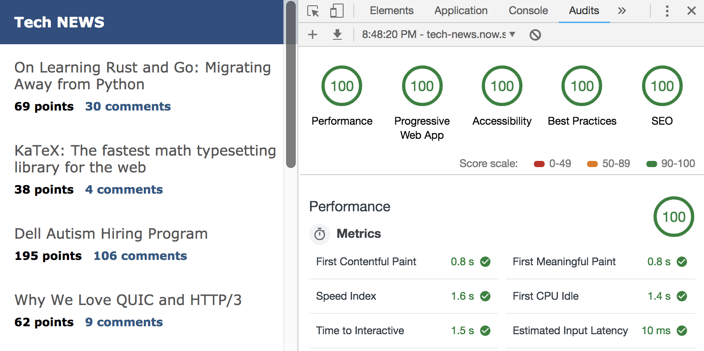

# next-tech-news

## Screen

## manifest.json
### CREATE manifest.json
URL: https://tomitm.github.io/appmanifest/  
SETTINGS:  

### GENERATE icons
URL: https://app-manifest.firebaseapp.com/
  
https://www.udemy.com/universal-react-with-nextjs-the-ultimate-guide
